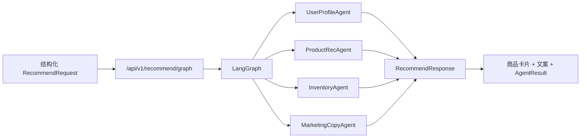
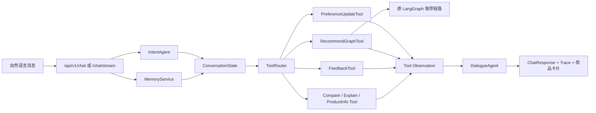
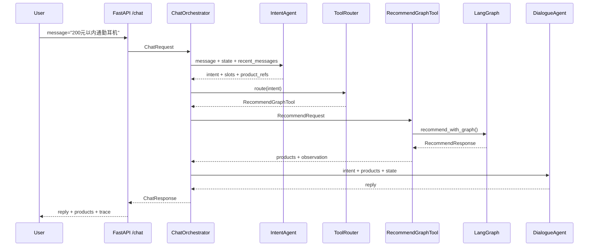
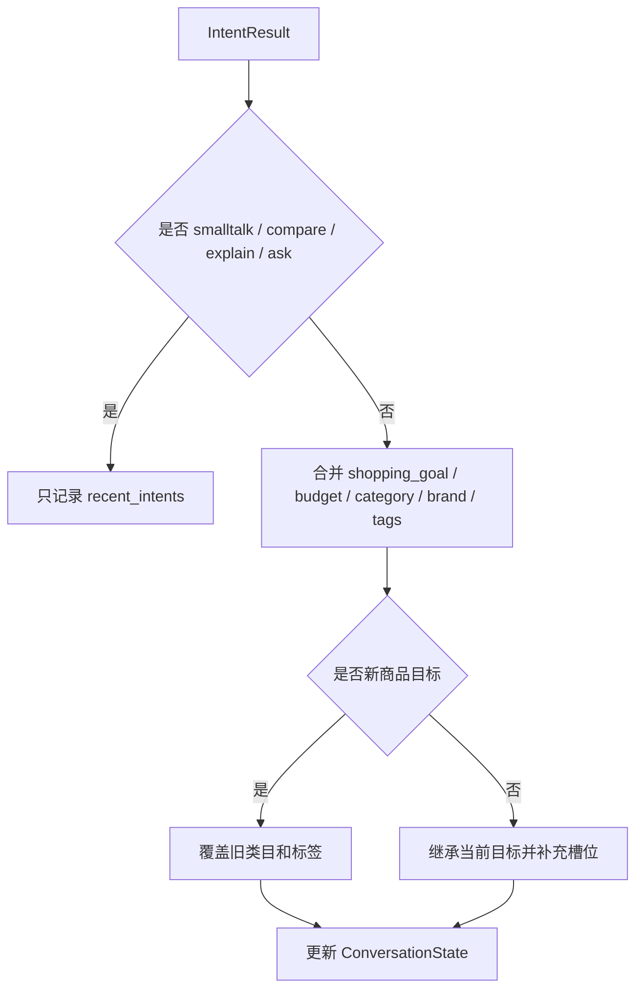
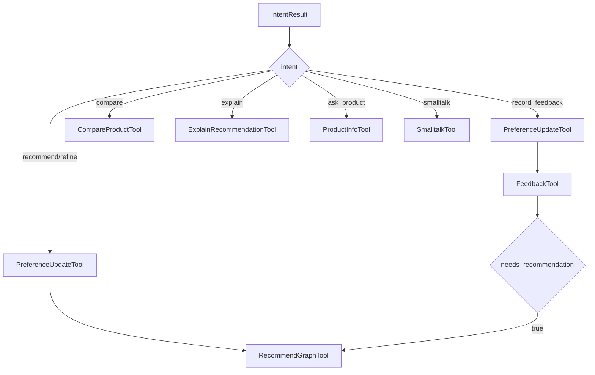
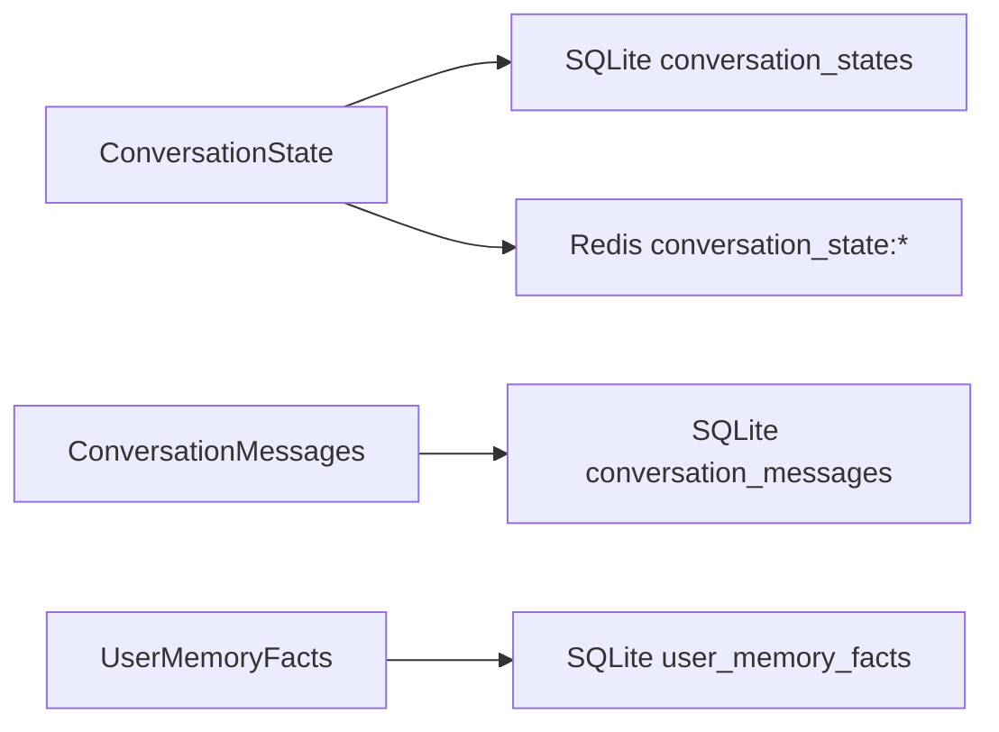
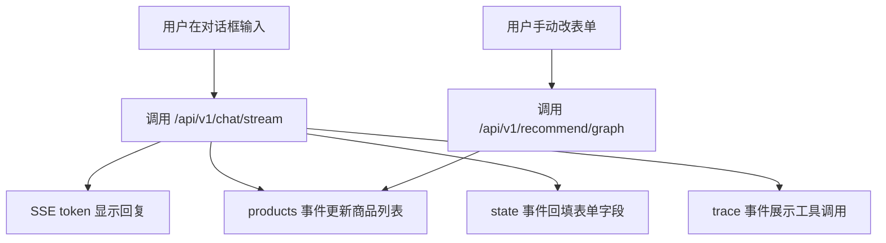

# 🎯 从纯 LangGraph 推荐到对话化电商 Agent：代码升级学习文档

这份文档说明当前项目从“纯 LangGraph 推荐链路”升级为“业务型 Conversational Commerce Agent”的关键代码变化。

原始版本的核心能力是：用户把结构化字段传给 `/api/v1/recommend/graph`，后端通过 LangGraph 串起用户画像、商品召回/重排、库存过滤、营销文案和 A/B 实验。升级后的版本没有推翻这条推荐链路，而是在它前面加了一层对话入口：用户可以直接说“我想买个 200 元以内的通勤耳机”，系统会先做意图识别和槽位抽取，再调用原来的 LangGraph 推荐链路。

> 💡 **一句话总结**：这次升级不是重写推荐系统，而是给原 LangGraph 推荐系统加了一个“能听懂自然语言、能维护上下文、能展示工具调用过程”的业务 Agent 外壳。

| 章节 | 核心问题 |
|------|----------|
| 0. 总览架构 | 升级前后系统长什么样 |
| 1. 原始 LangGraph 链路 | 纯结构化推荐是怎么工作的 |
| 2. 对话入口 | `/chat` 和 `/chat/stream` 做了什么 |
| 3. IntentAgent | 自然语言如何变成结构化字段 |
| 4. ChatOrchestrator | 对话状态如何驱动后端链路 |
| 5. Business Tool Layer | 为什么要加业务工具层 |
| 6. MemoryService | 多轮上下文和长期记忆如何实现 |
| 7. DialogueAgent | 为什么现在回复看起来像模板 |
| 8. 前端变化 | 为什么现在是“表单 + 对话框”混合模式 |
| 9. 测评体系 | 怎么判断这个 Agent 做得好不好 |
| 面试表达 | 面试中怎么讲这次升级 |

---

## 0. 🗺️ 总览架构

在推荐系统里，用户请求通常有两种形态。第一种是结构化请求，例如类目、品牌、预算已经由前端表单提供。第二种是自然语言请求，例如“预算 200 以内，通勤用耳机”。原始项目只擅长第一种；升级后，新增的对话层负责把第二种转成第一种。

### 0.1 升级前：纯 LangGraph 推荐链路



| 模块 | 输入 | 输出 | 作用 |
|------|------|------|------|
| `/api/v1/recommend/graph` | `RecommendRequest` | `RecommendResponse` | 接收结构化推荐请求 |
| `LangGraph` | 用户、类目、品牌、标签、预算 | 编排后的推荐结果 | 串联多个推荐 Agent |
| `ProductRecAgent` | 商品池和偏好 | 候选商品和排序结果 | 做召回与重排 |
| `InventoryAgent` | 候选商品 | 可售商品 | 过滤无库存商品 |
| `MarketingCopyAgent` | 商品和用户画像 | 推荐文案 | 生成或兜底营销文案 |

### 0.2 升级后：对话化业务 Agent 外壳



> 💡 **一句话总结**：升级后的对话系统不是让 LLM 直接推荐商品，而是让对话层把用户话语转换成可控的业务状态，再通过工具调用原来的推荐链路。

### 0.3 核心改动文件地图

| 文件 | 新增/改动 | 负责内容 |
|------|-----------|----------|
| `app/main.py` | 新增 chat 接口 | 暴露 `/api/v1/chat` 和 `/api/v1/chat/stream` |
| `app/orchestrator/chat.py` | 新增 | 对话主编排器，连接意图、记忆、工具和回复 |
| `app/agents/intent_agent.py` | 新增 | 意图识别、槽位抽取、指代理解 |
| `app/agents/dialogue_agent.py` | 新增 | 生成最终导购回复，默认规则兜底 |
| `app/tools/business_tools.py` | 新增 | 业务工具层和 ToolRouter |
| `app/services/memory.py` | 新增/增强 | 短期会话状态、消息历史、长期用户事实 |
| `app/models.py` | 扩展 | `ChatRequest`、`ChatResponse`、`ConversationState` 等模型 |
| `app/static/index.html` | 改造 | 保留原表单，增加对话框和 Trace 展示 |
| `scripts/evaluate_chat_agent.py` | 新增 | 对话 Agent 端到端测评 |
| `data/chat_eval_cases.jsonl` | 新增 | 多轮对话评测数据 |

---

## 1. 🧱 原始 LangGraph 链路

在推荐系统工程里，LangGraph 更适合处理“结构化状态流”。它接收的不是一句自然语言，而是一组已经整理好的业务字段：用户 ID、类目、品牌、标签、预算、最近浏览、不喜欢商品等。

### 1.1 什么是原始链路

在本项目中，原始 LangGraph 链路被定义为：从 `RecommendRequest` 出发，经由多个 Agent 节点处理，最终返回 `RecommendResponse` 的推荐状态图。

要理解它，需要拆成三个关键要素。首先是**结构化输入**，也就是前端表单或者 API 请求中已经明确给出的字段。其次是**多 Agent 编排**，每个 Agent 负责一个推荐阶段。最后是**统一响应模型**，前端拿到商品、文案、实验组和调试信息后渲染页面。

以电商推荐场景为例，原始链路可以很好地回答：“用户选择了手机类目、预算 200 元以内、偏好保护壳，应该推荐哪些商品？”但它不能直接理解“通勤用耳机预算别超过 200”这类自然语言。

### 1.2 原始接口

代码位置：

| 接口 | 文件 | 作用 |
|------|------|------|
| `POST /api/v1/recommend` | `app/main.py` | 旧 Supervisor 链路 |
| `POST /api/v1/recommend/graph` | `app/main.py` | 当前核心 LangGraph 链路 |

结构化请求示例：

```json
{
  "user_id": "u001",
  "scene": "homepage",
  "num_items": 3,
  "preferred_categories": ["手机"],
  "liked_brands": ["Bastmei"],
  "preferred_tags": ["保护壳", "手机配件"],
  "budget_max": 200,
  "disliked_products": [],
  "context": {}
}
```

### 1.3 原始链路的优势与局限

**优势**：结构清晰、结果稳定、容易测试，每个 Agent 的职责边界明确。

**局限**：

**① 用户输入门槛高。** 用户必须知道如何选择类目、品牌、标签和预算字段。如果用户只说一句自然语言，原始链路不能直接消费这句话，必须依赖前端或人工把它转成结构化字段。

**② 多轮上下文弱。** 原始请求天然是单次推荐。用户先说“想买耳机”，再说“预算 200”，再说“第二个太贵”，这些跨轮信息需要额外状态管理，不能只靠一次 `RecommendRequest` 表达。

**③ 指代理解缺失。** “第一个”“这款”“刚才那个”都不是商品 ID。原始 LangGraph 只认识商品 ID 和结构化字段，不负责把自然语言指代映射回商品。

> 🔗 **承上启下**：为了解决这些局限，升级版在 LangGraph 前面增加了 `ChatOrchestrator`、`IntentAgent`、`MemoryService` 和 `ToolRouter`。它们负责理解自然语言和维护上下文，然后再调用原来的 LangGraph。

---

## 2. 🚪 对话入口：从推荐 API 到 Chat API

对话化升级的第一步，是在原有推荐接口旁边新增聊天接口。这样可以保留原来的结构化推荐能力，同时允许用户通过自然语言驱动同一套推荐链路。

### 2.1 新增接口

代码位置：`app/main.py`

```text
POST /api/v1/chat
POST /api/v1/chat/stream
```

`/api/v1/chat` 用于普通 JSON 调试和离线评测。`/api/v1/chat/stream` 用于前端 SSE 流式体验。

请求结构：

```json
{
  "user_id": "u001",
  "session_id": "optional-session-id",
  "message": "我想买个200块左右的耳机，通勤用",
  "stream": false
}
```

响应结构新增了对话相关字段：

```json
{
  "session_id": "s-xxx",
  "intent": "recommend_products",
  "reply": "我按电子数码 耳机 通勤，预算不超过 200 元筛了这几款。",
  "state": {},
  "products": [],
  "marketing_copies": [],
  "agent_results": {},
  "trace": []
}
```

### 2.2 请求时序



> 💡 **一句话总结**：Chat API 的本质是把一句话包装成一次可观测的业务执行过程，而不是绕过原推荐链路。

---

## 3. 🧠 IntentAgent：自然语言转结构化业务字段

在对话式电商 Agent 中，意图识别不是为了“聊天好玩”，而是为了决定后端到底该调用哪个业务能力。用户说“推荐耳机”“第二个太贵”“为什么推荐这个”，三句话应该走完全不同的路径。

### 3.1 什么是 IntentAgent

在本项目中，`IntentAgent` 被定义为一个轻量 Query Understanding 模块：输入用户消息、当前会话状态和最近消息，输出 `intent`、`slots`、`product_refs`、`needs_recommendation`、`confidence` 和 `source`。

它有两个工作模式：

| 模式 | 触发条件 | 特点 |
|------|----------|------|
| LLM 模式 | `CHAT_LLM_ENABLED=true` | 调用大模型输出 JSON |
| 规则模式 | 默认模式 | 不依赖外部模型，稳定可测 |

当前默认是规则模式。代码位置：

- `app/agents/intent_agent.py`
- 入口方法：`_execute`
- 规则方法：`_rule_intent`
- 槽位抽取：`_extract_slots`

### 3.2 固定意图集合

| 意图 | 用户例子 | 后续动作 |
|------|----------|----------|
| `recommend_products` | 我想买耳机 | 调用推荐链路 |
| `refine_preferences` | 预算 200 以内 | 更新偏好并推荐 |
| `compare_products` | 第一个和第二个哪个好 | 调用比较工具 |
| `explain_recommendation` | 为什么推荐第一款 | 调用解释工具 |
| `record_feedback` | 第二个太贵了 | 记录反馈，必要时重新推荐 |
| `ask_product` | 第一款库存多少 | 调用商品信息工具 |
| `smalltalk` | 你是什么模型 | 闲聊兜底，不触发推荐 |

### 3.3 槽位抽取规则

`IntentAgent` 会从自然语言里抽取这些结构化字段：

| 槽位 | 示例 | 输出 |
|------|------|------|
| 预算上限 | `200以内` | `budget_max=200` |
| 预算范围 | `100到300` | `budget_min=100, budget_max=300` |
| 预算下限 | `至少500` | `budget_min=500` |
| 品类 | `手机` | `preferred_categories=["手机"]` |
| 商品类型 | `电脑` | `preferred_categories=["电子数码"], preferred_tags=["电脑配件"]` |
| 用途标签 | `通勤` | `preferred_tags=["通勤"]` |
| 品牌 | `Samsung` | `liked_brands=["SAMSUNG"]` |
| 指代 | `第二个` | 根据 `active_product_refs` 解析商品 ID |

### 3.4 例子：一句话如何变成结构化状态

用户输入：

```text
我想买个200元以内的通勤耳机
```

规则抽取结果：

```json
{
  "intent": "recommend_products",
  "slots": {
    "budget_max": 200,
    "preferred_categories": ["电子数码"],
    "preferred_tags": ["耳机", "通勤"],
    "shopping_goal": "电子数码 耳机 通勤"
  },
  "product_refs": [],
  "needs_recommendation": true,
  "confidence": 0.82,
  "source": "rule"
}
```

### 3.5 优势与局限

**优势**：规则模式稳定、便宜、延迟低，适合 demo 和线上高频入口兜底。

**局限**：

**① 泛化能力有限。** 规则依赖关键词和已有商品标签。如果用户说“降噪豆”“上班地铁用”“不要入耳式”，规则未覆盖时可能漏抽槽位。

**② 复杂约束表达弱。** 规则能处理 `200以内` 和 `100到300`，但对“不要太笨重、续航久一点、兼容苹果生态”这类复合偏好，需要更多词典或 LLM 辅助。

**③ 意图边界需要持续维护。** “再便宜一点”既是反馈，也是重新推荐请求。规则需要明确优先级，否则可能误判为普通补槽。

> 🔗 **承上启下**：IntentAgent 负责理解用户说了什么，但理解后的结果还需要执行。下一层 `ChatOrchestrator` 负责把意图和槽位合并进会话状态，并交给工具层处理。

---

## 4. 🎛️ ChatOrchestrator：对话主编排器

在升级后的系统里，`ChatOrchestrator` 是对话链路的核心控制器。它不直接做商品排序，也不直接生成商品，它负责把意图识别、状态管理、工具调用和最终回复串起来。

### 4.1 核心职责

代码位置：`app/orchestrator/chat.py`

| 职责 | 关键代码 |
|------|----------|
| 读取会话状态 | `self.memory.get_or_create_state(...)` |
| 读取长期记忆 | `self.memory.user_memory_summary(...)` |
| 调用意图识别 | `self.intent_agent.run(...)` |
| 合并槽位到状态 | `_apply_intent_to_state(...)` |
| 解析商品指代 | `_resolve_product_refs(...)` |
| 构造推荐请求 | `_recommend_request_from_state(...)` |
| 调用工具路由 | `self.tool_router.route(...)` |
| 保存状态和消息 | `save_state`、`append_message` |
| 输出 SSE | `stream_chat(...)` |

### 4.2 状态合并逻辑

`_apply_intent_to_state` 是多轮对话的关键。它解决的是：用户每一轮只说一部分需求，系统怎么把这些碎片拼成当前购物目标。



关键规则：

| 场景 | 行为 |
|------|------|
| `想要手机` 后 `想要电脑` | 新目标覆盖旧目标 |
| `想买耳机` 后 `预算200` | 补槽，继承耳机目标 |
| `第二个太贵` | 继承当前推荐列表，记录负反馈 |
| `你好`、`今天星期几` | 不污染购物状态 |

### 4.3 推荐请求构造

`_recommend_request_from_state` 把对话状态转换成原 LangGraph 能理解的 `RecommendRequest`。

转换关系：

| ConversationState | RecommendRequest |
|-------------------|------------------|
| `user_id` | `user_id` |
| `preferred_categories` | `preferred_categories` |
| `liked_brands` | `liked_brands` |
| `preferred_tags` | `preferred_tags` |
| `budget_min / budget_max` | `budget_min / budget_max` |
| `disliked_products` | `disliked_products` |
| `shopping_goal` | `context.shopping_goal` |

### 4.4 优势与局限

**优势**：把对话状态和推荐链路解耦，保留原 LangGraph 作为核心能力，降低重构风险。

**局限**：

**① 编排器承担了较多 glue code。** 当前 `ChatOrchestrator` 既负责状态合并，又负责 trace 聚合，还负责请求转换。随着业务复杂度提升，可以继续拆出 `StateReducer` 或 `ConversationPolicy`。

**② 状态规则还是人工定义。** 新目标覆盖、补槽继承、闲聊不污染，这些规则目前写死在代码中。真实系统可能需要结合用户行为和业务策略动态调整。

**③ 多工具组合还比较线性。** 当前一次 intent 通常只走一个主工具。复杂任务例如“比较后推荐更便宜替代品”可能需要多步 planner，但这不是当前主线。

> 🔗 **承上启下**：ChatOrchestrator 决定“要做什么”，Business Tool Layer 则把每个业务动作封装成可观测工具，让执行过程像 coding agent 一样有 trace。

---

## 5. 🧰 Business Tool Layer：业务型工具调用

这里借鉴了 coding agent 的思想，但没有做通用代码编辑 Agent。项目只抽象了电商业务工具：推荐、偏好更新、反馈、比较、解释、商品信息问答和闲聊。

### 5.1 为什么要加工具层

在业务 Agent 中，直接在 orchestrator 里写一堆 `if intent == ...` 可以跑通 demo，但不利于展示和扩展。工具层把每个业务动作封装成统一对象，让系统能输出 observation。

统一 observation 格式：

```json
{
  "step": "tool",
  "tool_name": "RecommendGraphTool",
  "success": true,
  "input_summary": {
    "categories": ["电子数码"],
    "tags": ["耳机", "通勤"],
    "budget_max": 200
  },
  "output_summary": {
    "strategy": "langgraph_agents+vector_recall+inventory_filter+ab_test",
    "product_count": 3
  },
  "latency_ms": 120.3,
  "error": null
}
```

### 5.2 工具列表

代码位置：`app/tools/business_tools.py`

| 工具 | 作用 | 是否调用原推荐链路 |
|------|------|--------------------|
| `PreferenceUpdateTool` | 展示状态更新 observation | 否 |
| `RecommendGraphTool` | 调用 `recommend_with_graph` | 是 |
| `FeedbackTool` | 记录 like/dislike/purchase | 否 |
| `CompareProductTool` | 比较当前推荐过的商品 | 否 |
| `ExplainRecommendationTool` | 解释为什么推荐某款 | 否 |
| `ProductInfoTool` | 回答价格、库存、评分 | 否 |
| `SmalltalkTool` | 闲聊兜底 | 否 |

### 5.3 ToolRouter 路由规则



### 5.4 推荐工具如何复用原 LangGraph

最重要的点在 `RecommendGraphTool`：

```python
response = recommend_with_graph(context.recommend_request)
```

这说明对话化升级没有改坏原推荐 pipeline。自然语言只是被转换成 `RecommendRequest`，真正的商品召回、重排、库存和文案仍然走原 LangGraph。

### 5.5 优势与局限

**优势**：工具边界清晰，trace 可解释，面试时可以讲清楚“Agent 每一步做了什么”。

**局限**：

**① 工具还不是严格外部工具协议。** 当前工具是 Python 类，不是 OpenAI function calling 或 MCP 工具协议。如果未来接大模型 planner，需要再定义更标准的 schema。

**② compare/explain 还是轻量规则。** 比较和解释只基于当前会话商品数据，不做复杂知识库检索。它适合面试 demo，但不是完整商品问答系统。

**③ 缺少复杂多步规划。** 当前 `ToolRouter` 是单轮路由，不会自主循环多步执行。为了业务稳定，这个取舍是合理的。

> 🔗 **承上启下**：工具层解决了“怎么执行”，但真实导购还需要记住用户前后文。下一层 `MemoryService` 负责短期会话和长期偏好。

---

## 6. 🧩 MemoryService：短期上下文与长期记忆

电商对话不是一次性搜索框。用户可能先说“想买耳机”，再补“预算 200”，再说“第二个太贵”，系统必须理解这些话属于同一个购物任务。

### 6.1 记忆分层

代码位置：`app/services/memory.py`



| 记忆类型 | 表/缓存 | 用途 |
|----------|---------|------|
| 短期状态 | `conversation_states` | 当前会话购物目标、预算、指代映射 |
| 消息历史 | `conversation_messages` | 最近 8 轮对话，给 LLM 意图识别使用 |
| 长期事实 | `user_memory_facts` | 用户偏好、品牌、预算、拒绝原因 |
| Redis 缓存 | `conversation_state:*` | 加速读取最新会话状态 |

### 6.2 ConversationState 结构

```json
{
  "shopping_goal": "电子数码 耳机 通勤",
  "budget_min": null,
  "budget_max": 200,
  "preferred_categories": ["电子数码"],
  "liked_brands": [],
  "preferred_tags": ["耳机", "通勤"],
  "disliked_products": [],
  "rejected_reasons": [],
  "last_recommended_product_ids": ["p1", "p2", "p3"],
  "active_product_refs": {
    "第一个": "p1",
    "第二个": "p2",
    "这款": "p1"
  },
  "recent_intents": ["recommend_products"]
}
```

### 6.3 长期记忆如何冷启动

`user_memory_summary(user_id)` 会从 `user_memory_facts` 读取长期事实，然后在 `_recommend_request_from_state` 中使用。

关键策略：

```text
如果当前 state 有明确类目/品牌/标签/预算：
    使用当前 state
否则：
    用长期记忆补位
```

这个策略避免了一个常见问题：用户历史喜欢手机保护壳，但当前明确说“想要电脑”，系统不能继续推荐手机。

### 6.4 反馈如何影响记忆

`FeedbackTool` 做两件事：

| 用户动作 | 行为事件 | 短期状态变化 |
|----------|----------|--------------|
| `不喜欢第二个` | 写 `dislike` | 商品加入 `disliked_products` |
| `第二个太贵` | 写 `dislike` | 增加 `too_expensive` 原因 |
| `喜欢第一个` | 写 `like` | 合并商品类目、品牌、标签 |
| `购买第一个` | 写 `purchase` | 合并商品类目、品牌、标签 |

### 6.5 优势与局限

**优势**：支持多轮补槽、目标切换、指代理解和长期偏好冷启动。

**局限**：

**① 长期事实还没有衰减机制。** 当前 `user_memory_facts` 只做去重和最近读取，没有按时间衰减偏好强度。真实推荐系统通常需要考虑偏好时效性。

**② 记忆事实粒度偏简单。** 当前事实是 `fact_type + fact_value`，还没有置信度、来源权重和冲突解决。例如用户以前喜欢 Sony，现在明确说不要 Sony，还需要更复杂的策略。

**③ Redis 只是缓存状态。** Redis 当前用于缓存会话状态和行为特征，不负责复杂 session store 或分布式一致性。

> 🔗 **承上启下**：记忆层让系统知道“用户上下文是什么”，但用户看到的最终表达还需要 DialogueAgent 生成。

---

## 7. 🗣️ DialogueAgent：为什么现在像固定话术

当前版本用户看到的回答比较固定，这是有意设计。第一版优先保证推荐结果、上下文和 trace 稳定，不让大模型自由生成未验证优惠、库存和价格承诺。

### 7.1 回复生成模式

代码位置：`app/agents/dialogue_agent.py`

| 模式 | 开关 | 说明 |
|------|------|------|
| LLM 回复 | `CHAT_LLM_ENABLED=true` | 调用 `llm_client.chat` |
| 规则回复 | 默认 | 根据 intent 和 products 生成模板 |

默认情况下：

```text
CHAT_LLM_ENABLED=false
```

所以走 `_rule_reply` 和 `_smalltalk_reply`。

### 7.2 规则回复示例

| intent | 回复逻辑 |
|--------|----------|
| `recommend_products` | “我按 xxx 筛了这几款...” |
| `compare_products` | 返回比较工具生成的价格/评分/库存说明 |
| `explain_recommendation` | 返回解释工具生成的推荐依据 |
| `ask_product` | 返回商品价格、库存、评分 |
| `smalltalk` | 回答你是谁、什么模型、日期等 |

### 7.3 为什么不默认开 LLM

| 原因 | 说明 |
|------|------|
| 稳定性 | 面试 demo 不依赖外部 API |
| 成本 | 高频入口不需要每轮都打大模型 |
| 安全 | 避免编造折扣、最低价、库存事实 |
| 可测 | 规则输出更容易做端到端评测 |

> 💡 **一句话总结**：当前不是“不能用大模型”，而是默认用规则保证稳定；需要时可以打开 `CHAT_LLM_ENABLED=true` 让 IntentAgent 和 DialogueAgent 接入 LLM。

---

## 8. 🖥️ 前端变化：保留原页面，加对话入口

前端没有改成纯聊天窗口，而是保留原结构化推荐页面，再加一个对话框。这是一个重要的产品取舍。

### 8.1 为什么保留原表单

| 原因 | 价值 |
|------|------|
| 对比清楚 | 面试时能展示升级前后差异 |
| 稳定可控 | 用户仍可手动输入结构化字段 |
| 方便调试 | 可以看到自然语言 slots 回填后的效果 |
| 不破坏旧功能 | 原推荐页面和行为按钮继续可用 |

### 8.2 当前前端流程



### 8.3 Trace 展示价值

Trace 能说明系统每一步做了什么：

```text
intent:recommend_products
-> PreferenceUpdateTool
-> RecommendGraphTool
-> dialogue
-> done
```

面试中这很重要，因为它能证明项目不是“一个黑盒 LLM 调用”，而是可观测、可降级、可解释的业务 Agent。

---

## 9. 📏 测评体系：怎么判断这个 Agent 好不好

对话化升级后，不能只看“有没有返回商品”。一个合格的电商 Agent 至少要评估意图、槽位、记忆、指代、预算、库存和延迟。

### 9.1 测评文件

| 文件 | 作用 |
|------|------|
| `data/chat_eval_cases.jsonl` | 多轮对话评测样本 |
| `scripts/evaluate_chat_agent.py` | 评测脚本 |
| `reports/chat_agent_eval_latest.json` | 最新评测报告 |

### 9.2 核心指标

| 指标 | 含义 | 初始合格线 |
|------|------|------------|
| `intent_macro_f1` | 意图识别 F1 | `>= 0.85` |
| `slot_f1` | 槽位抽取 F1 | `>= 0.80` |
| `memory_consistency_rate` | 多轮状态是否一致 | `>= 0.90` |
| `product_ref_resolution_rate` | 第一个/第二个是否解析成功 | `>= 0.85` |
| `task_success_rate` | 任务整体是否成功 | `>= 0.80` |
| `budget_compliance_rate` | 是否满足预算 | `>= 0.95` |
| `inventory_compliance_rate` | 是否有库存 | `= 1.00` |
| `avg_latency_ms` | 平均延迟 | `<= 1500` |
| `unsupported_claim_rate` | 是否有无依据承诺 | `<= 0.02` |

### 9.3 运行评测

```powershell
python scripts\evaluate_chat_agent.py
```

当前 Step 21 后的验证结果：

```text
intent_macro_f1 = 1.0
slot_f1 = 1.0
memory_consistency_rate = 1.0
product_ref_resolution_rate = 1.0
task_success_rate = 1.0
budget_compliance_rate = 1.0
inventory_compliance_rate = 1.0
```

注意：不要和 `pytest` 并行跑这个评测，因为测试 fixture 会清空同一套 SQLite/Redis 状态，导致多轮 eval 被干扰。

---

## 10. 🧪 可运行调试命令

### 10.1 启动服务

```powershell
D:\anaconda\python.exe -m uvicorn app.main:app --host 127.0.0.1 --port 8010
```

### 10.2 测试对话接口

```powershell
$body = @{
  user_id = "study-user"
  session_id = "study-session"
  message = "我想买个200元以内的通勤耳机"
} | ConvertTo-Json

Invoke-RestMethod `
  -Method Post `
  -Uri http://127.0.0.1:8010/api/v1/chat `
  -ContentType "application/json; charset=utf-8" `
  -Body $body
```

预期重点观察：

```text
intent = recommend_products
state.budget_max = 200
state.preferred_categories 包含 电子数码
state.preferred_tags 包含 耳机、通勤
trace 包含 PreferenceUpdateTool 和 RecommendGraphTool
products 返回 3 个商品
```

### 10.3 测试指代理解和负反馈

```powershell
$first = @{
  user_id = "study-user"
  session_id = "study-feedback"
  message = "推荐几款手机保护壳"
} | ConvertTo-Json

Invoke-RestMethod `
  -Method Post `
  -Uri http://127.0.0.1:8010/api/v1/chat `
  -ContentType "application/json; charset=utf-8" `
  -Body $first

$second = @{
  user_id = "study-user"
  session_id = "study-feedback"
  message = "第二个太贵了，换便宜点"
} | ConvertTo-Json

Invoke-RestMethod `
  -Method Post `
  -Uri http://127.0.0.1:8010/api/v1/chat `
  -ContentType "application/json; charset=utf-8" `
  -Body $second
```

预期重点观察：

```text
intent = record_feedback
trace 包含 FeedbackTool 和 RecommendGraphTool
state.disliked_products 包含第二个商品 ID
state.rejected_reasons 包含 too_expensive
```

---

## 📊 全景对比

| 维度 | 升级前：纯 LangGraph | 升级后：对话化业务 Agent |
|------|----------------------|---------------------------|
| 输入方式 | 结构化表单/API | 结构化表单 + 自然语言 |
| 核心推荐链路 | LangGraph | 仍然是 LangGraph |
| 用户意图识别 | 无 | `IntentAgent` |
| 多轮上下文 | 弱 | `ConversationState` |
| 指代理解 | 无 | `active_product_refs` |
| 负反馈 | 行为按钮 | 对话反馈 + 行为事件 |
| 业务工具 | 无统一抽象 | `BusinessTool` + `ToolRouter` |
| 可观测性 | AgentResult | AgentResult + Tool Observation + Trace |
| 回复生成 | 前端/固定结果 | `DialogueAgent` 规则/LLM 可选 |
| 测评 | 推荐离线评测 | 推荐评测 + Chat Eval |

---

## 🎯 选择指南

什么时候走原结构化推荐？

```text
用户已经在表单里明确选了类目、品牌、标签、预算
-> 直接调用 /api/v1/recommend/graph
```

什么时候走对话 Agent？

```text
用户输入自然语言需求、多轮补充、负反馈、商品比较、推荐解释
-> 调用 /api/v1/chat 或 /api/v1/chat/stream
```

什么时候需要 LLM？

```text
规则能覆盖：预算、常见品类、品牌、反馈、指代
-> 默认规则即可

用户表达复杂：场景化、隐含偏好、多条件冲突
-> 打开 CHAT_LLM_ENABLED=true，让 LLM 做意图和回复增强
```

---

## 🎤 面试表达

### 30 秒版本

原项目已经有 LangGraph 编排的电商推荐链路，可以基于结构化字段完成用户画像、商品召回/重排、库存过滤和营销文案生成。我这次没有重写推荐链路，而是在前面加了一个 Conversational Commerce Agent 外壳：通过 `IntentAgent` 把自然语言解析成品类、预算、品牌、用途和反馈，再由 `ToolRouter` 调用业务工具，其中推荐工具继续复用原 `recommend_with_graph`。同时我加了 `MemoryService` 管理多轮上下文、商品指代和长期用户事实，并通过 trace 展示每一步工具调用，方便调试和面试说明。

### 2 分钟版本

这个升级分三层。

第一层是入口层。我在原来的 `/api/v1/recommend/graph` 旁边新增了 `/api/v1/chat` 和 `/api/v1/chat/stream`。前者用于测试和离线评测，后者用于前端 SSE 流式输出。前端保留原结构化推荐页面，同时新增对话框，对话输入会驱动下方商品列表刷新。

第二层是理解和执行层。`IntentAgent` 负责把用户自然语言转成固定业务意图，比如推荐、补槽、比较、解释、反馈、商品问答和闲聊。默认使用规则识别，保证 demo 稳定；也预留了 `CHAT_LLM_ENABLED` 开关，可以让 LLM 输出 JSON 意图。识别结果进入 `ChatOrchestrator`，合并到 `ConversationState`，然后由 `ToolRouter` 选择业务工具。推荐场景会调用 `RecommendGraphTool`，它内部仍然调用原来的 `recommend_with_graph`。

第三层是记忆和评测。`MemoryService` 用 SQLite 保存会话、消息和长期用户事实，Redis 可用时缓存最新状态。短期状态里保存购物目标、预算、偏好、最近推荐商品和“第一个/第二个”的映射；长期事实用于新会话冷启动，但当前会话明确目标优先，避免历史偏好污染当前请求。最后我加了 `scripts/evaluate_chat_agent.py` 和 `data/chat_eval_cases.jsonl`，用 intent F1、slot F1、memory consistency、product ref resolution、budget compliance、inventory compliance 等指标评估这个对话 Agent。

### 常见追问

**追问 1：你这个是不是只是固定话术和筛选？**

可以这样回答：第一版默认确实以规则为主，但不是简单固定对话。规则层负责 query understanding，把自然语言解析成结构化业务字段；后续推荐仍然走原 LangGraph 链路，包括向量召回、重排、库存和文案。固定话术主要在 `DialogueAgent`，目的是保证安全和可测，避免大模型编造优惠或库存。需要更自然表达时，可以打开 `CHAT_LLM_ENABLED=true`，让 LLM 参与意图识别和回复生成。

**追问 2：为什么不直接用大模型做推荐？**

可以这样回答：电商推荐涉及库存、价格、行为画像和 A/B 实验，这些必须由后端系统校验。大模型适合理解和表达，不适合直接决定商品事实。所以我让 LLM 或规则只负责理解用户意图，真正推荐仍由 Python 工具和 LangGraph 执行，保证结果可控、可评测、可追踪。

**追问 3：长期记忆怎么避免污染当前需求？**

可以这样回答：我在 `_recommend_request_from_state` 里做了优先级控制：当前会话 state 有明确类目、品牌、标签或预算时，优先用当前 state；只有对应字段为空，才用 `user_memory_facts` 的长期记忆补位。比如用户历史喜欢手机保护壳，但当前说“想要电脑”，系统会推荐电子数码/电脑配件，不会继续推荐手机。

**追问 4：ToolRouter 和 coding agent 有什么关系？**

可以这样回答：我没有做通用 coding agent，只借鉴了 coding agent 的 tool calling、observation 和 trace 思路。每个业务动作都是一个工具，例如 `RecommendGraphTool`、`FeedbackTool`、`ProductInfoTool`。工具返回统一 observation，前端可以展示每一步输入、输出、耗时和错误，这让业务 Agent 更可解释。

**追问 5：怎么证明升级有效？**

可以这样回答：我增加了 chat eval 数据集和脚本，覆盖单轮推荐、多轮补槽、目标切换、指代理解、负反馈、比较、解释、商品问答和闲聊兜底。核心指标包括 `intent_macro_f1`、`slot_f1`、`memory_consistency_rate`、`product_ref_resolution_rate`、`budget_compliance_rate` 和 `inventory_compliance_rate`。当前规则版本在已有 eval set 上这些指标都达到 1.0，后续可以用更复杂数据继续压测。

---

## 📝 小结

这次代码升级可以用一句话概括：

```text
在原 LangGraph 推荐链路前，加了一个可观测、可记忆、可路由的对话业务 Agent 外壳。
```

它的工程价值在于：

- 没有推翻原系统，复用了已有推荐 pipeline。
- 把自然语言理解和推荐执行解耦。
- 用 ToolRouter 和 observation 提升可观测性。
- 用 MemoryService 支持多轮上下文和长期偏好。
- 用 chat eval 让对话 Agent 有指标可测。

下一步如果继续增强，可以做 Step 22 的评测体系完善，以及 Step 23 的规则、LLM、BERT/DistilBERT Query Understanding 对比实验。

---

## 📚 参考资料

| 资料 | 用途 |
|------|------|
| `README.md` | 原始推荐系统整体介绍 |
| `AGENTS.md` | Conversational Commerce Agent 路线图 |
| `app/orchestrator/graph.py` | 原 LangGraph 推荐链路 |
| `app/orchestrator/chat.py` | 对话主编排器 |
| `app/agents/intent_agent.py` | 意图识别和槽位抽取 |
| `app/tools/business_tools.py` | 业务工具层 |
| `app/services/memory.py` | 对话记忆服务 |
| `scripts/evaluate_chat_agent.py` | 对话 Agent 评测脚本 |
