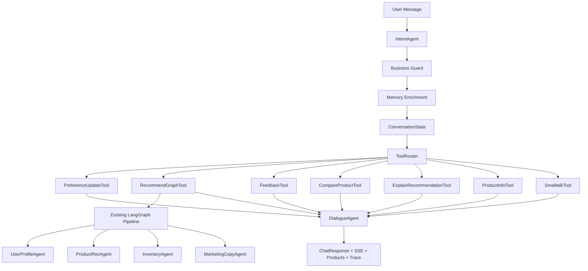

# Conversational Commerce Agent Final Report

## 项目定位

本项目从一个结构化电商推荐系统，升级为业务型 Conversational Commerce Agent。核心原则是：

- LLM 负责理解复杂表达和自然回复。
- Python 负责状态、路由、工具调用、约束校验和测评。
- 原 LangGraph 推荐链路保持不变，对话层只作为业务入口和编排外壳。

一句话介绍：

> 用户可以像和导购聊天一样表达需求，系统会识别意图、抽取预算/品类/品牌/用途，结合会话记忆和行为画像，调用原 LangGraph 推荐链路，并返回商品卡片、推荐解释和可观测 trace。

## 当前能力

| 能力 | 当前实现 |
|---|---|
| 结构化推荐 | 保留原表单、商品卡片、行为按钮 |
| 对话推荐 | `/api/v1/chat` 和 `/api/v1/chat/stream` |
| 意图识别 | Rule / BERT / LLM 三模式 |
| 意图对比 | 前端“对比理解”面板 |
| 业务稳定性 | Business Guard 防止模型误判 |
| 短期记忆 | `conversation_states` 保存当前 session 目标 |
| 长期记忆 | `user_memory_facts` 保存跨 session 偏好 |
| 行为画像 | `user_events` 构建类目、品牌、标签偏好 |
| 业务工具 | Recommend / Feedback / Compare / Explain / ProductInfo / Smalltalk |
| 闲聊兜底 | Smalltalk Policy + LLM fallback |
| 端到端测评 | `scripts/evaluate_chat_agent.py` |

## 架构图



## 对话链路

```text
用户输入
-> IntentAgent 识别 intent + slots
-> Business Guard 校正明显误判
-> Memory Enrichment 补全上下文和历史偏好
-> ToolRouter 选择业务工具
-> 推荐类请求继续走原 LangGraph
-> DialogueAgent 生成回复
-> MemoryService 写回状态和长期事实
-> 前端展示商品、trace、guard、memory 来源
```

## 意图识别设计

固定意图集合：

```text
recommend_products
refine_preferences
compare_products
explain_recommendation
record_feedback
ask_product
smalltalk
```

三种 Query Understanding 模式：

| 模式 | 作用 | 优点 | 缺点 |
|---|---|---|---|
| Rule | baseline 和兜底 | 快、稳定、可解释 | 泛化有限 |
| BERT | 高频意图分类 | 延迟低于大模型、适合线上入口 | slot 仍依赖规则 |
| LLM | 复杂自然语言理解 | 泛化强 | 成本、延迟和稳定性需要 guard |

最终策略不是“谁分数高听谁的”，而是：

```text
规则抽业务槽位
-> 模型给 intent 候选
-> Business Guard 判断是否允许覆盖
-> 输出最终 intent/slots
```

## Business Guard

Guard 解决的问题：

- BERT 把“200 元以内通勤耳机”误判成 `ask_product`
- LLM 输出空品类或不稳定 intent
- 闲聊误触发推荐
- 负反馈被误判为普通推荐

当前 guard 类型：

| Guard | 触发条件 |
---|---|
| `smalltalk_guard` | 高置信闲聊不允许模型改成推荐 |
| `feedback_guard` | 明确负反馈不允许被覆盖 |
| `business_slot_recommendation_guard` | 已抽到预算/品类/用途时，不允许改成无关意图 |

前端左侧会显示：

```text
Guard: applied · business_slot_recommendation_guard · ask_product -> refine_preferences
```

## 记忆设计

### 短期会话记忆

存储在 `conversation_states`。

主要字段：

```text
shopping_goal
budget_min / budget_max
preferred_categories
liked_brands
preferred_tags
disliked_products
rejected_reasons
last_recommended_product_ids
active_product_refs
recent_intents
```

用途：

- 第一轮：“我想买个 200 元以内的通勤耳机”
- 第二轮：“再推荐几个”
- 系统继承耳机、通勤、预算。

### 长期对话记忆

存储在 `user_memory_facts`。

每轮对话后把稳定偏好写成 fact：

```text
shopping_goal
budget_min / budget_max
preferred_category
liked_brand
preferred_tag
rejected_reason
```

### 行为画像记忆

来自 `user_events`：

```text
view / like / dislike / purchase
```

构建 `UserProfile`：

```text
preferred_categories
liked_brands
preferred_tags
recent_views
disliked_products
cart_items
```

### Query Understanding 记忆补全

当用户只说“再推荐几个”“给我推荐几个”这类空槽位请求时：

```text
short_term_session
-> long_term_memory
-> behavior_profile
```

前端左侧会显示：

```text
Memory: short_term_session:preferred_tags/budget_max
```

## 闲聊设计

闲聊不是全部交给大模型，而是先走 Smalltalk Policy。

| 类型 | 策略 |
|---|---|
| greeting | 规则模板 |
| agent_identity_or_capability | 规则模板，保证身份稳定 |
| date_or_time | 规则回答 |
| visual_capability | 规则回答，避免假装看屏幕 |
| open_smalltalk | 允许 LLM fallback |

LLM fallback 约束：

- 不触发推荐。
- 不写购物偏好记忆。
- 不编造价格、库存、优惠券、最低价、物流承诺。
- 回复 1-2 句，最后可以轻轻引导回购物需求。

## 端到端测评

运行：

```bash
python scripts/evaluate_chat_agent.py
```

当前报告：

- JSON: `reports/chat_agent_eval_latest.json`
- Markdown: `reports/chat_agent_eval_latest.md`

当前结果：

| Metric | Value |
|---|---:|
| case_count | 15 |
| intent_macro_f1 | 1.0 |
| slot_f1 | 1.0 |
| memory_consistency_rate | 1.0 |
| task_success_rate | 1.0 |
| tool_success_rate | 1.0 |
| budget_compliance_rate | 1.0 |
| inventory_compliance_rate | 1.0 |
| memory_enrichment_success_rate | 1.0 |
| smalltalk_policy_rate | 1.0 |
| unsupported_claim_rate | 0.0 |
| avg_latency_ms | about 215 ms |

覆盖场景：

- 单轮推荐
- 多轮补槽
- 目标切换
- 预算/品牌/用途抽取
- 指代理解
- 负反馈
- 商品比较
- 推荐解释
- 商品信息问答
- 长期记忆
- 短期记忆续问
- 闲聊兜底
- 闲聊不污染购物状态

## 面试讲法

可以按这个顺序讲：

1. 原项目是 LangGraph 多 Agent 推荐链路，输入是结构化字段。
2. 我没有重写推荐链路，而是在前面加了 Conversational Shell。
3. 用户自然语言先进入 Query Understanding，输出业务 intent 和 slots。
4. Rule、BERT、LLM 三种方式可以对比，前端有对比面板。
5. 线上不能让模型直接决定结果，所以我加了 Business Guard。
6. 对话系统必须有记忆，因此分成短期 session、长期 facts、行为画像三层。
7. 推荐、反馈、比较、解释、商品问答都是业务工具，不做通用 coding agent。
8. 闲聊有边界，身份和能力用规则，开放闲聊才用 LLM fallback。
9. 最后用端到端 eval 证明意图、slots、memory、guard、工具调用和约束都可测。

一句话收尾：

> 这个项目的重点不是把所有事情都交给 LLM，而是把 LLM 放在业务系统可控的位置上，用规则、记忆、工具和测评把电商推荐 Agent 做成可解释、可测试、可演示的系统。

