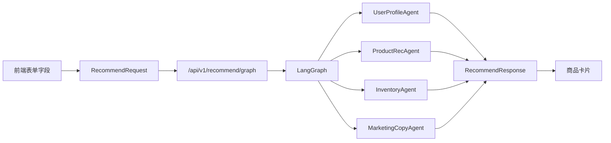
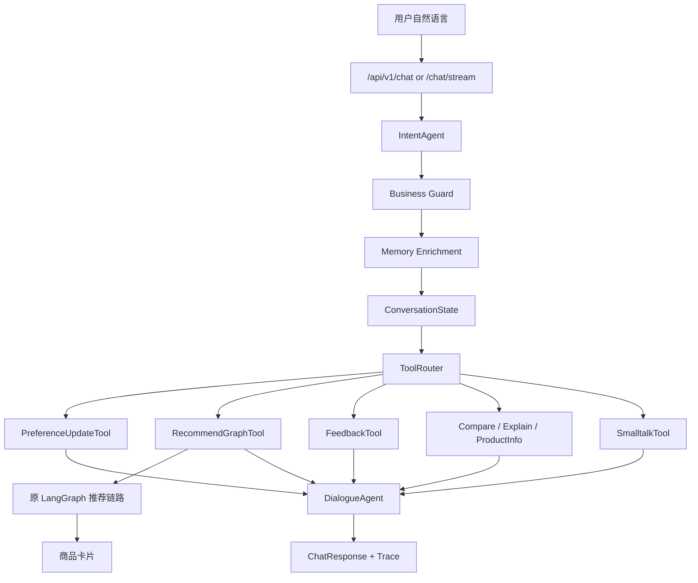
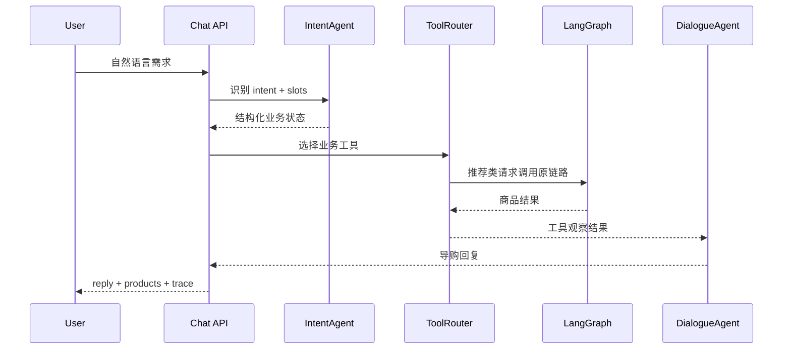
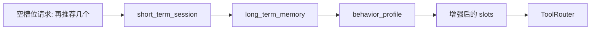
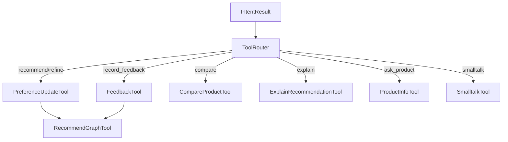

# 🎯 从 LangGraph 推荐系统到对话式电商 Agent：升级代码学习文档

这份文档专门解释本项目相对于最初“纯 LangGraph 结构化推荐系统”的升级部分。原项目已经有一条能工作的推荐链路：用户在前端表单里选择用户 ID、类目、品牌、标签和预算，后端把这些结构化字段交给 LangGraph 编排的多 Agent 推荐流水线，最后返回商品卡片。

升级后的目标不是推翻原推荐链路，而是在它前面加一个业务型对话外壳。用户可以直接说“我想买个 200 元以内的通勤耳机”“第二个太贵了”“为什么推荐第一个”，系统先把自然语言转成业务状态，再复用原来的 LangGraph 推荐链路。

| 章节 | 核心问题 |
|---|---|
| 0. 总览 | 原项目和升级后项目有什么区别 |
| 1. 对话入口 | `/chat` 如何接住自然语言 |
| 2. 意图识别 | Rule / BERT / LLM 如何协同 |
| 3. Business Guard | 为什么不能让模型直接说了算 |
| 4. 记忆系统 | 短期记忆、长期记忆、行为画像怎么配合 |
| 5. Tool Layer | 为什么要做业务工具层 |
| 6. DialogueAgent | 回复和闲聊兜底怎么做 |
| 7. 前端升级 | 为什么保留表单，同时加对话框 |
| 8. 测评体系 | 怎么证明这个 Agent 做得好 |
| 9. 面试表达 | 如何把这个项目讲清楚 |

---

## 0. 🧭 总体架构：升级前后发生了什么

在电商推荐系统里，最原始、最稳定的输入方式是结构化字段。例如用户明确选择“手机”“Sony”“预算 200 元以内”，后端就可以直接按字段召回和排序。但真实用户往往不会这么填表，而是说自然语言：“通勤用的耳机，200 左右，别太重”。对话式升级解决的就是这个入口问题。

> 💡 **一句话总结**：原项目负责“给定结构化字段后如何推荐商品”，升级后的项目负责“把用户自然语言变成可控的结构化字段，再调用原推荐链路”。

### 0.1 升级前：结构化推荐链路



| 模块 | 输入 | 输出 | 作用 |
|---|---|---|---|
| `RecommendRequest` | 类目、品牌、标签、预算 | 结构化请求 | 推荐链路的标准输入 |
| `LangGraph` | 推荐请求 | 多 Agent 中间结果 | 编排推荐流水线 |
| `ProductRecAgent` | 用户画像和商品池 | 候选商品 | 召回和重排 |
| `InventoryAgent` | 候选商品 | 可售商品 | 过滤无库存 |
| `MarketingCopyAgent` | 商品和用户画像 | 推荐文案 | 生成或兜底营销文案 |

### 0.2 升级后：对话式业务 Agent 外壳



| 新增层 | 代码位置 | 解决的问题 |
|---|---|---|
| 对话 API | `app/main.py` | 给自然语言提供入口 |
| 对话编排 | `app/orchestrator/chat.py` | 串联意图、记忆、工具和回复 |
| 意图识别 | `app/agents/intent_agent.py` | 把自然语言变成 intent + slots |
| 记忆服务 | `app/services/memory.py` | 维护多轮上下文和长期偏好 |
| 业务工具 | `app/tools/business_tools.py` | 把不同意图路由到业务动作 |
| 回复生成 | `app/agents/dialogue_agent.py` | 生成导购回复和闲聊兜底 |
| 混合前端 | `app/static/index.html` | 保留表单，同时加入对话框和 trace |

---

## 1. 🔌 对话入口：`/chat` 如何接住自然语言

原项目的核心入口是 `/api/v1/recommend/graph`，它只接收结构化的 `RecommendRequest`。升级后新增了两个对话入口：`/api/v1/chat` 和 `/api/v1/chat/stream`。前者适合测试和离线评估，后者用 SSE 给前端流式返回回复、商品和 trace。

### 1.1 请求与响应结构

对话请求模型在 `app/models.py` 中：

```python
class ChatRequest(BaseModel):
    user_id: str
    session_id: str | None = None
    message: str
    stream: bool = False
    force_experiment_group: str | None = None
    intent_mode: ChatIntentMode = "rule"
```

重点字段：

| 字段 | 作用 |
|---|---|
| `user_id` | 绑定用户画像、行为历史和长期记忆 |
| `session_id` | 绑定短期会话状态 |
| `message` | 用户自然语言 |
| `intent_mode` | 指定 Rule / BERT / LLM 意图识别模式 |
| `force_experiment_group` | 用于演示 A/B 对照组或实验组 |

对话响应 `ChatResponse` 不只返回文本，还返回商品、状态和 trace：

```python
class ChatResponse(BaseModel):
    session_id: str
    intent: ChatIntent
    reply: str
    state: ConversationState
    products: list[RecommendedProduct]
    marketing_copies: list[MarketingCopy]
    agent_results: dict[str, AgentResult]
    trace: list[dict[str, Any]]
```

### 1.2 ChatOrchestrator 是核心中枢

`ChatOrchestrator.chat()` 在 `app/orchestrator/chat.py:31`。它做的事情可以理解成一条稳定流水线：

```text
读取 state 和 memory
-> IntentAgent 识别意图
-> Memory Enrichment 补全上下文
-> 状态合并
-> ToolRouter 选择工具
-> DialogueAgent 生成回复
-> 写回 state 和 memory facts
-> 返回 ChatResponse
```

### 1.3 为什么不直接让 LLM 推荐

直接让 LLM 根据用户输入推荐商品有三个问题。第一，它容易编造商品、库存和优惠；第二，推荐结果难以复用原有召回、排序、库存和 A/B 逻辑；第三，评测和调试困难。

本项目的做法是让 LLM 只参与“理解和表达”，真正的商品推荐仍然交给 Python 和原 LangGraph 链路：



---

## 2. 🧠 意图识别：Rule / BERT / LLM 如何协同

用户一句话进入系统后，第一步不是推荐商品，而是理解它属于什么业务意图。比如“帮我找耳机”是推荐，“第二个太贵”是负反馈，“为什么推荐第一个”是解释，“你好”是闲聊。

### 2.1 固定意图集合

意图类型定义在 `app/models.py`：

```text
recommend_products
refine_preferences
compare_products
explain_recommendation
record_feedback
ask_product
smalltalk
```

| 意图 | 示例 | 后续动作 |
|---|---|---|
| `recommend_products` | 我想买耳机 | 更新偏好并推荐 |
| `refine_preferences` | 预算 200 以内 | 补充状态并推荐 |
| `compare_products` | 第一个和第二个哪个好 | 调用对比工具 |
| `explain_recommendation` | 为什么推荐这个 | 调用解释工具 |
| `record_feedback` | 第二个太贵了 | 记录反馈并重推 |
| `ask_product` | 这款库存多少 | 查询商品信息 |
| `smalltalk` | 你好 / 你是什么 agent | 闲聊兜底 |

### 2.2 三种识别模式

`IntentAgent` 在 `app/agents/intent_agent.py:25` 定义了三种模式：

```python
VALID_INTENT_MODES = {"rule", "bert", "llm"}
```

| 模式 | 代码路径 | 定位 |
|---|---|---|
| Rule | `_rule_intent` | 稳定 baseline，抽 slots |
| BERT | `_apply_model_intent` | 高频意图分类实验 |
| LLM | `_llm_intent` | 复杂自然语言理解 |

核心调度在 `IntentAgent._execute()`，位置是 `app/agents/intent_agent.py:35`。当前策略不是“三选一谁强用谁”，而是：

```text
先跑 Rule 得到业务槽位
-> 如果模式是 BERT，用 BERT 给 intent 候选
-> 如果模式是 LLM，用 LLM 给 intent 候选
-> 最后统一进入 Business Guard
```

### 2.3 slots 是什么

slots 是从自然语言里抽出来的结构化业务字段。比如：

```text
我想买个 200 元以内的通勤耳机
```

会变成：

```json
{
  "budget_max": 200,
  "preferred_categories": ["电子数码"],
  "preferred_tags": ["耳机", "通勤"],
  "shopping_goal": "电子数码 耳机 通勤"
}
```

在推荐系统里，slots 比 intent 更接近真实业务价值。intent 决定“走哪条路径”，slots 决定“推荐什么”。

---

## 3. 🛡️ Business Guard：为什么不能让模型直接说了算

真实业务系统里，模型可能误判。比如 BERT 把“200 元以内通勤耳机”误判成 `ask_product`，或者 LLM 返回空品类。如果系统完全相信模型，就会不触发推荐，或者丢掉预算和品类约束。

Business Guard 的作用就是在模型输出之后做业务级校验。

### 3.1 Guard 的代码位置

核心方法在 `app/agents/intent_agent.py:171`：

```python
def _apply_business_guard(
    self,
    candidate: IntentResult,
    rule_result: IntentResult,
    rule_debug: dict[str, Any],
) -> IntentResult:
```

它的输入有两个：

| 输入 | 含义 |
|---|---|
| `candidate` | BERT 或 LLM 输出的候选结果 |
| `rule_result` | 规则系统抽到的业务槽位和基础意图 |

### 3.2 当前 Guard 类型

| Guard | 触发条件 | 效果 |
|---|---|---|
| `smalltalk_guard` | 高置信闲聊 | 不允许模型改成推荐 |
| `feedback_guard` | 明确负反馈 | 不允许覆盖为普通推荐 |
| `business_slot_recommendation_guard` | 已抽到预算/品类/用途，但模型改成无关意图 | 拉回推荐或补槽路径 |

### 3.3 前端如何展示

左侧 Query Understanding 会显示：

```text
Guard: applied · business_slot_recommendation_guard · ask_product -> refine_preferences
```

这行信息很适合面试演示，因为它说明系统不是“模型黑盒输出”，而是有业务约束层。

> 💡 **一句话总结**：Business Guard 把模型从“最终裁判”降级为“候选建议者”，最终结果必须满足电商业务约束。

---

## 4. 🧩 记忆系统：短期、长期、行为画像怎么配合

对话系统如果没有记忆，就会像一次性搜索框。用户第一轮说“200 元以内通勤耳机”，第二轮说“再推荐几个”，系统必须知道“再”指的还是耳机、通勤和 200 元预算。

### 4.1 短期会话记忆

短期记忆保存在 `ConversationState`，定义在 `app/models.py`：

```python
class ConversationState(BaseModel):
    session_id: str
    user_id: str
    shopping_goal: str = ""
    budget_min: float | None = None
    budget_max: float | None = None
    preferred_categories: list[str] = Field(default_factory=list)
    liked_brands: list[str] = Field(default_factory=list)
    preferred_tags: list[str] = Field(default_factory=list)
    disliked_products: list[str] = Field(default_factory=list)
    rejected_reasons: list[str] = Field(default_factory=list)
    last_recommended_product_ids: list[str] = Field(default_factory=list)
    active_product_refs: dict[str, str] = Field(default_factory=dict)
    recent_intents: list[str] = Field(default_factory=list)
```

短期记忆由 `MemoryService.get_or_create_state()` 读取，位置是 `app/services/memory.py:18`。

### 4.2 长期对话记忆

每轮对话结束后，系统会把稳定偏好写入 `user_memory_facts`。代码在 `app/services/memory.py:142`：

```python
def record_memory_facts(
    self,
    *,
    user_id: str,
    facts: dict[str, Any],
    source: str,
) -> None:
```

长期记忆摘要由 `user_memory_summary()` 读取，位置是 `app/services/memory.py:177`。

### 4.3 行为画像记忆

行为画像来自真实行为事件：

```text
view / like / dislike / purchase
```

代码在 `app/behavior.py`。用户点赞或购买过的商品，会被转换成：

```text
preferred_categories
liked_brands
preferred_tags
recent_views
disliked_products
cart_items
```

### 4.4 Query Understanding 里的记忆补全

Step 30 后，记忆不只是影响推荐排序，也参与 Query Understanding。核心方法在 `app/orchestrator/chat.py:164`：

```python
def _enrich_intent_with_memory(...):
```

补全顺序：



示例：

| 对话轮次 | 用户输入 | 系统状态 |
|---|---|---|
| 第 1 轮 | 我想买个 200 元以内的通勤耳机 | 记住耳机、通勤、预算 |
| 第 2 轮 | 再推荐几个 | 从短期记忆补全同样条件 |

前端显示：

```text
Memory: short_term_session:preferred_tags/budget_max
```

---

## 5. 🧰 Tool Layer：为什么要做业务工具层

“Agent 风格”不等于让模型自由行动。这个项目只借鉴 coding agent 里的 router、tool calling、trace、observation 思路，但工具全部是电商业务工具。

### 5.1 工具列表

代码在 `app/tools/business_tools.py`。

| 工具 | 触发意图 | 作用 |
|---|---|---|
| `PreferenceUpdateTool` | 推荐、补槽、反馈 | 更新会话状态 |
| `RecommendGraphTool` | 需要推荐 | 调用原 LangGraph 推荐链路 |
| `FeedbackTool` | 负反馈、喜欢、购买 | 记录行为并调整状态 |
| `CompareProductTool` | 商品比较 | 对比当前会话商品 |
| `ExplainRecommendationTool` | 解释推荐 | 解释为什么推荐某款 |
| `ProductInfoTool` | 商品问答 | 回答价格、库存、评分 |
| `SmalltalkTool` | 闲聊 | 不触发推荐 |

### 5.2 ToolRouter 如何工作



每个工具都会返回 `ToolObservation`，再进入 trace。这样前端能显示：

```text
PreferenceUpdateTool -> RecommendGraphTool -> dialogue -> done
```

这对调试和面试都很重要：面试官能看到系统为什么推荐、调用了哪些工具、每一步耗时多少。

---

## 6. 💬 DialogueAgent：回复和闲聊兜底怎么做

推荐系统不是只返回商品，还要给用户一个自然、克制、可解释的导购回复。`DialogueAgent` 负责最终回复生成，代码在 `app/agents/dialogue_agent.py`。

### 6.1 购物回复

对于推荐、反馈、比较、解释、商品问答，`DialogueAgent` 会优先尝试 LLM 回复；如果 LLM 不可用或回复不安全，就用规则模板。

规则回复的价值是稳定，比如：

```text
我按你的预算和用途筛了这几款，优先考虑相关度、库存和价格。
```

### 6.2 闲聊策略

Step 31 后，闲聊不再是简单模板，而是 Smalltalk Policy + LLM fallback。

代码位置：

- `SMALLTALK_LLM_PROMPT`: `app/agents/dialogue_agent.py:16`
- `_smalltalk_policy`: `app/agents/dialogue_agent.py:114`
- `_llm_smalltalk_reply`: `app/agents/dialogue_agent.py:146`

闲聊分型：

| 类型 | 是否允许 LLM | 原因 |
|---|---|---|
| greeting | 否 | 模板足够 |
| agent_identity_or_capability | 否 | 身份边界必须稳定 |
| date_or_time | 否 | 规则回答更确定 |
| visual_capability | 否 | 避免假装能看屏幕 |
| open_smalltalk | 是 | 开放闲聊可由 LLM 兜底 |

LLM fallback 的系统提示明确限制：

```text
不触发商品推荐
不记录用户购物偏好
不编造商品价格、库存、优惠券、最低价、物流承诺
```

---

## 7. 🖥️ 前端升级：为什么保留表单，同时加对话框

最初前端是结构化表单。升级后没有删除它，而是在右侧加了自然语言对话框。这样做有两个好处：

1. 保留原系统能力，用户仍然可以手动传结构化字段。
2. 对话输入识别出的 slots 可以回填左侧字段，并刷新下方商品列表。

### 7.1 前端新增能力

代码在 `app/static/index.html`。

| 区域 | 作用 |
|---|---|
| Intent 下拉 | 选择 Rule / BERT / LLM |
| 对话框 | 输入自然语言 |
| 对比理解 | 同一句话对比三种意图识别结果 |
| Query Understanding | 展示 source、confidence、slots、Guard、Memory |
| Intent Eval | 展示离线评测指标 |
| Agent Trace | 展示工具调用路径 |

### 7.2 演示路径

推荐演示顺序：

```text
1. 先展示左侧结构化推荐仍然可用
2. 输入“我想买个200元以内的通勤耳机”
3. 看左侧字段被回填，商品列表刷新为耳机
4. 点“对比理解”，看 Rule/BERT/LLM 差异
5. 输入“再推荐几个”，看 Memory 来源
6. 输入“你是什么agent”，看 smalltalk 不触发推荐
```

---

## 8. 📊 测评体系：怎么证明这个 Agent 做得好

一个 Agent 项目如果只有 demo，面试时容易被问：“怎么证明它真的有效？”所以项目加入了端到端测评。

### 8.1 测评脚本

脚本位置：

```text
scripts/evaluate_chat_agent.py
```

运行：

```bash
python scripts/evaluate_chat_agent.py
```

输出：

```text
reports/chat_agent_eval_latest.json
reports/chat_agent_eval_latest.md
```

### 8.2 核心指标

| 指标 | 含义 |
|---|---|
| `intent_macro_f1` | 多轮意图识别是否正确 |
| `slot_f1` | 预算、品类、标签等槽位是否正确 |
| `memory_consistency_rate` | 状态记忆是否一致 |
| `product_ref_resolution_rate` | 第一款、第二款等指代是否解析成功 |
| `task_success_rate` | 任务整体是否完成 |
| `tool_success_rate` | 是否调用了期望工具 |
| `budget_compliance_rate` | 商品是否符合预算 |
| `inventory_compliance_rate` | 商品是否有库存 |
| `memory_enrichment_success_rate` | 记忆补全后任务是否成功 |
| `smalltalk_policy_rate` | 闲聊策略是否覆盖 |
| `unsupported_claim_rate` | 是否出现未支持承诺 |

### 8.3 当前报告结果

当前 `reports/chat_agent_eval_latest.md` 中的关键结果：

| 指标 | 当前值 |
|---|---:|
| case_count | 15 |
| intent_macro_f1 | 1.0 |
| slot_f1 | 1.0 |
| task_success_rate | 1.0 |
| tool_success_rate | 1.0 |
| memory_enrichment_success_rate | 1.0 |
| smalltalk_policy_rate | 1.0 |
| unsupported_claim_rate | 0.0 |
| avg_latency_ms | 约 215 ms |

> 💡 **一句话总结**：测评覆盖的不只是推荐结果，还覆盖意图识别、槽位抽取、记忆补全、工具调用、闲聊边界和安全承诺。

---

## 9. 🎤 面试表达

### 9.1 30 秒版本

这个项目原来是一个基于 LangGraph 的结构化电商推荐系统。我做的升级是在原推荐链路前面加了一个 Conversational Agent 外壳：用户可以用自然语言表达预算、品类、用途和反馈，系统通过 Rule/BERT/LLM 做意图识别，再经过 Business Guard、记忆补全和业务工具路由，最后复用原 LangGraph 推荐链路返回商品卡片。我还做了 trace、对比理解面板和端到端 eval，能证明意图、slots、记忆、工具调用和推荐约束都可测。

### 9.2 2 分钟版本

我没有把原来的推荐系统推翻重写，而是保留 LangGraph 推荐链路，把对话层作为上游入口。用户输入后，`IntentAgent` 会识别 intent 和 slots，支持 Rule、BERT 和 LLM 三种模式。为了避免模型误判，我加了 Business Guard，例如已经抽到预算和品类时，不允许模型把请求改成商品问答。

在多轮对话上，我做了三层记忆：短期 session state、长期 memory facts、用户行为画像。比如用户第一轮说“200 元以内通勤耳机”，第二轮说“再推荐几个”，系统会从短期记忆里补全耳机、通勤和预算。用户历史喜欢过某个品牌，也会作为行为画像参与理解。

路由层我没有做通用 coding agent，而是做业务工具：推荐、反馈、比较、解释、商品信息问答和闲聊。推荐类工具最终仍然调用原 LangGraph 链路。前端保留结构化表单，同时加了对话框、意图对比、Guard、Memory 和 Trace 展示。最后我用端到端 eval 覆盖单轮推荐、多轮补槽、目标切换、指代理解、负反馈、记忆、闲聊等场景。

### 9.3 常见追问

**问题 1：为什么不用 LLM 直接推荐？**

因为电商推荐涉及商品事实、库存、价格、预算约束和 A/B 实验。如果 LLM 直接推荐，容易编造事实，也绕开了原有召回和排序链路。我让 LLM 只参与理解和表达，商品推荐仍由 Python 和 LangGraph 控制。

**问题 2：BERT 在这里起什么作用？**

BERT 主要用于高频意图分类实验。它比大模型便宜，适合作为线上入口分类器。但 slot 抽取仍然使用规则和业务词典，最终结果还要经过 Business Guard。

**问题 3：记忆是怎么做的？**

记忆分三层。短期会话状态解决多轮上下文，长期 facts 解决跨 session 偏好，行为画像来自用户 view/like/dislike/purchase。Query Understanding 会在空槽位请求里按短期、长期、行为画像顺序补全 slots。

**问题 4：怎么保证闲聊不污染推荐？**

闲聊 intent 会走 SmalltalkTool，不触发 RecommendGraphTool，也不会写购物偏好。身份和能力问题用规则回答，开放闲聊才允许 LLM fallback，而且 prompt 限制它不能编造商品事实。

**问题 5：怎么证明系统有效？**

我做了端到端 eval，覆盖意图、槽位、记忆、指代、工具调用、预算、库存、闲聊和安全承诺。报告输出 JSON 和 Markdown，当前核心指标都达到设定阈值。

---

## 📊 全景对比

| 维度 | 原项目 | 升级后 |
|---|---|---|
| 输入方式 | 表单字段 | 表单 + 自然语言 |
| 推荐链路 | LangGraph | 保持不变 |
| 用户理解 | 前端手动字段 | IntentAgent 自动抽取 |
| 意图识别 | 无 | Rule / BERT / LLM |
| 上下文 | 无对话状态 | ConversationState |
| 长期偏好 | 行为事件影响推荐 | 行为 + memory facts 参与理解 |
| 工具调用 | 推荐链路内部 Agent | 显式业务 Tool Layer |
| 可观测性 | agent_results | trace + guard + memory + compare |
| 闲聊 | 无 | Smalltalk Policy + LLM fallback |
| 测评 | 推荐离线指标 | Chat Agent E2E Eval |

## 📚 关键代码地图

| 文件 | 学习重点 |
|---|---|
| `app/main.py` | API 入口、chat、stream、query compare |
| `app/orchestrator/chat.py` | 对话主编排、记忆补全、状态合并 |
| `app/agents/intent_agent.py` | Rule/BERT/LLM、Business Guard |
| `app/agents/dialogue_agent.py` | 回复生成、Smalltalk Policy |
| `app/services/memory.py` | 短期和长期记忆 |
| `app/behavior.py` | 行为画像 |
| `app/tools/business_tools.py` | 业务工具层 |
| `app/static/index.html` | 混合前端、对比理解、trace 展示 |
| `scripts/evaluate_chat_agent.py` | 端到端测评 |

## 🧾 小结

这个升级的核心价值不是“加了一个聊天框”，而是把一个结构化推荐系统升级成可解释、可测试、可控的业务型 Agent。它保留了原来的 LangGraph 推荐能力，又补上了自然语言理解、业务路由、上下文记忆、模型 guard、闲聊边界和端到端测评。

如果用一句话概括最终设计：

> 让 LLM 做理解和表达，让 Python 做状态、工具、约束和评测，让原 LangGraph 推荐链路继续负责真正的商品推荐。

